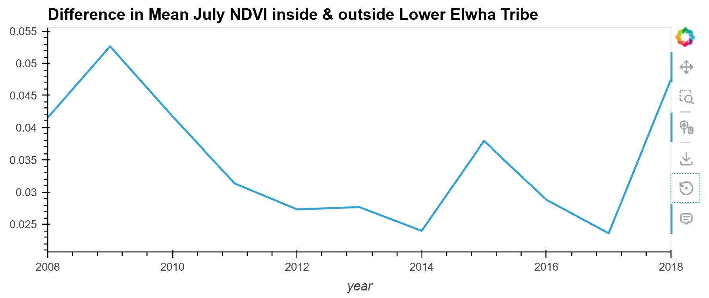

## **Welcome to my portfolio!**

#### Contact Information
**Email:** [nym.veach@gmail.com](mailto:nym.veach@gmail.com)  
**LinkedIn:** [www.linkedin.com/in/nym-veach](https://www.linkedin.com/in/nym-veach)  
**GitHub:** [github.com/nym-veach](https://github.com/nym-veach)

#### Professional & Educational Background

I’m currently a student in the Earth Data Analytics Graduate Certificate Program at CU Boulder, where I’m developing skills in geospatial analysis, data analytics, and utilizing data to address complex environmental challenges. My coursework focuses on processing and visualizing environmental data, using tools like Python and Jupyter Notebooks, and applying these skills to real-world projects. I use Python libraries such as pandas, geopandas, numpy, matplotlib, scikit-learn, xarray, rioxarray, and more to explore, analyze, and model environmental datasets.

Previously, I worked as an Environmental Scientist at the North Dakota Department of Environmental Quality, overseeing regulatory compliance and data monitoring for safe drinking water, including disinfection byproducts, volatile organic compounds, pesticides, and inorganic chemicals. Additionally, I worked with the Dakota Resource Council, a grassroots environmental nonprofit, supporting community engagement on sustainable natural resource and land-use issues. I graduated summa cum laude with a B.S. in Natural Resources Management from North Dakota State University, with an emphasis in physical and earth resources science.

#### About Me
Outside of work, I love writing, reading, hiking, meditation, travel, and spending time with my three cats. 
*“Instructions for living a life. Pay attention. Be astonished. Tell about it.” -Mary Oliver*

#### Interest Areas
- Water Resources, Hydrology, & Hydrogeology
- Water Quality Monitoring
- Geospatial Analysis (GIS)
- Time-Series Analysis of Environmental Data
- Applied Machine Learning for Environmental Data
- Environmental Chemistry & Chemical Contaminants (Drinking Water)
- Nonpoint Source Pollution
- Flood Risk Mitigation
- Stormwater Managemant
- Climate Change Impacts
- Environmental Planning
- Science-Based Policy

## <u> Projects </u>
#### **Elwha River Dam Removal - Chinook Salmon (Oncorhynchus tshawytscha) Recovery Analysis using Python**

    
**Return of the King: Chinook Salmon Recovery in the Elwha River Watershed (2012–2014)**

Chinook salmon are back in the Elwha River following dam removals. Using Python, geospatial analysis, and USGS snorkeling survey data, I analyzed their return, observing increases in total counts and densities from pre- to post-dam removal surveys. Higher densities appeared even in previously inaccessible upstream areas, suggesting population-scale recovery.

Chinook are a keystone species important for nutrient cycling and as a food source for predators. Dam removal released trapped wood and sediment, reshaping the riverbed and creating new habitat, while quickly rebounding downstream populations. This recovery also has cultural and social significance for the Lower Elwha Klallam Tribe, supporting food security and tribal sovereignty.

Limitations included coarse survey frequency and missing reach-level coordinates, with future analysis possible for spatial patterns, other salmon species, and correlations with hydrologic or water quality data. Overall, this work highlights habitat restoration, environmental justice, and the importance of rewilding rivers through dam removal. [Explore the full data visualization and analysis](https://nym-veach.github.io/portfolio_posts/elwha-river-salmon-project-final.html)

<u>Data Citation:</u> 
USGS. (2021). Riverscape snorkeling surveys of salmonid distribution and abundance before (2007, 2008) and after (2018, 2019) dam removal on the Elwha River, Washington [Dataset]. USGS Science Data Catalog

U.S. Geological Survey. Watershed Boundary Dataset (WBD), 8‑digit Hydrologic Unit Code 17110020 — Dungeness‑Elwha. National Geospatial Technical Operations Center, 2025.

#### **Lower Elwha Klallum Tribe - Elwha River Dam Removal - Vegetation Changes NDVI Analysis using Python**

**Tracking Vegetation Recovery to Elwha River Dam Removal: NDVI Changes Within and Outside the Lower Elwha Klallam Tribe Boundary (2008–2018)**

As more dams are being removed, it is important to look at changes in ecological health over time to ensure restoration of the river’s health. This analysis of NDVI data within the Lower Elwha Klallam Tribe (LEKT) boundary revealed modest changes in vegetation over the 2008-2018 following the removal of the Elwha and Glines Canyon Dams. We do see a possible decrease in vegetation health outside the boundary which could be due to things like changes in sediment changes at the mouth of the river or urban development. While the dataset showed limited NDVI increases on tribal lands at the mouth of the river specifically, other studies and field observations indicate that vegetation recovery is occurring elsewhere in the larger watershed. This limited change near shore is consistent with other findings that saw relatively little vegetation change at the mouth of the river in the first 3 years following dam removal (Foley et al., 2017). We do see a possible increase in vegetation health towards the end of the timeframe explored, meaning that there could be more changes if looking further into the future.

Several factors likely explain the relatively small NDVI changes observed within the LEKT boundary. Vegetation recovery often occurs gradually over time, and the strongest responses are expected in areas that were previously submerged, eroded, or otherwise impacted by the dams. These locations may not be within the LEKT analyzed along the river mouth in this dataset. Additionally, natural variation, climate influences, and the substantial pre-existing vegetation cover in that area can mask short-term NDVI responses in remote sensing data.

During this analysis and project, a key takeaway is that post-dam vegetation recovery is not spatially homogenous across the watershed and could use further study following dam removals (Shafroth, Rosi, & Pess, 2024). The Elwha River is one of the most well-studied dam removal projects in the world, yet there is still a lot to be understood. The largest increases are likely to occur in regions directly influenced by restored hydrology and sediment transport rather than uniformly across the watershed or at the mouth of the river on the tribal lands. This suggests that when evaluating ecological restoration such as vegetation health with remote sensing data, it is important to carefully select areas most likely to experience change, which can provide a more complete picture of recovery. Future analysis could use different polygon data to work with the larger watershed and see changes across the entire watershed.  [Check out the full data analysis](https://nym-veach.github.io/portfolio_posts/elhwa-river-ndvi.html), with maps, interactive figures, and full raster geospatial processing.

<u>Data Citation:</u> 
Lower Elwha Klallam Tribe. (n.d.). Home. Retrieved November 21, 2025, from https://www.elwha.org

Didan, K. (2021). MODIS/Terra Vegetation Indices 16-Day L3 Global 250 m SIN Grid V061 [Dataset]. NASA Land Processes Distributed Active Archive Center. https://doi.org/10.5067/MODIS/MOD13Q1.061

#### **Trumpeter Swan (Cygnus buccinator) Migration Analysis using Python**

Click the swan to explore the full analysis & interactive migration map!

  Photo: Andy Reago &amp; Chrissy McClarren / CC BY 2.0 via Wikimedia Commons

**Following the Flight: Where Can You Find the Trumpeter Swan (Cygnus buccinator) Throughout the Year?**

Trumpeter Swans are a native North American swan and a symbol of resilience, grace, and beauty. They also tell a story of successful conservation efforts to protect wetlands and threatened species. Exploring their migration, Trumpeter Swans spend the winter in inland areas such as the Midwest and along the U.S. coasts where waters remain ice-free, then travel to Alaska, Canada, and the northwestern U.S. to breed in spring and summer (Cornell Lab of Ornithology, n.d.).

Recovering from near-extinction due to hunting, habitat loss, pollution, and human disturbance is not easy. Trumpeter Swans have made a serious comeback, but the fight is far from over. They are iconic, easily identifiable, and an important indicator species for freshwater ecosystem health and water resources management.

This analysis used Python with GBIF occurrence data spatially joined to WWF ecoregion polygons to create the species migration map. Normalized mean occurrence reduced spatial and temporal sampling variability. While wetland, water quality, or hydrologic data were not included, this analysis provides a foundation for future studies linking swan migration to freshwater ecosystem health and informing data-driven water management.

<u>Data Citation:</u> 
Species Occurence: GBIF.org (26 October 2025) GBIF Occurrence Download https://doi.org/10.15468/dl.6kxqja

Ecoregion boundaries: Dinerstein, E., Olson, D. M., Joshi, A., Vynne, C., Burgess, N. D., & Wikramanayake, E. D. (2017). RESOLVE Ecoregions 2017. RESOLVE. Dataset accessed on October 11, 2025. https://www.resolve.ngo/projects/ecoregions-world

#### **Climate Change & Large Freshwater Lakes: Lake Superior’s Story Shows How Air Temperatures Alone Can Mislead**

  <iframe 
    src="img/lake-superior-temp-interactive.html" 
    width="100%" 
    height="600" 
    style="border:none; min-width: 800px;">
  </iframe>

Lake Superior is the largest lake by surface area in the world, holding approximately 10% of the planet’s fresh surface water, and is among the fastest warming large lakes globally. At first glance, one might think the Lake Superior region isn’t being impacted by climate change, since near-shore air temperatures show a slight cooling trend (slope = –0.002 °C/year, R² = 0.02). This R² indicates that most of the temperature variation is natural and that the trend line explains very little of it.

Grand Marais, MN station along the shoreline was used as a land-based proxy to get near-shore lake air temperatures. This analysis highlights how air temperatures alone don’t tell the full story of climate change or explain complex air–land–water interactions. While local air temperatures appear stable or slightly cooling, broader regional and water temperature data reveal clear warming and climate change impacts such as increased precipitation, reduced ice cover, stronger storms, and changing habitats.

Large lakes like Lake Superior can modulate local air temperatures, acting as a thermal buffer by absorbing/storing heat, which can mask the full effects of climate change when examining air data alone. [View the full data analysis](https://nym-veach.github.io/portfolio_posts/01-lake-superior-shoreline-climate-change.html) for data cleaning, visualization, trend calculation, references, and further discussion.

<u>Data Citation:</u>  
Menne, M. J., Durre, I., Korzeniewski, B., McNeill, S., Thomas, K., Yin, X., Anthony, S., Ray, R., Vose, R. S., Gleason, B. E., & Houston, T. G. (2012). Global Historical Climatology Network – Daily (GHCN-Daily), Version 3: Grand Marais, MN (USC00213282), 1920–2020. NOAA National Centers for Environmental Information. https://doi.org/10.7289/V5D21VHZ [Accessed October 4, 2025]

#### **Map of Lake Metigoshe created with Python**
Lake Metigoshe is an transboundary waterway near where I grew up, on the international border between North Dakota and Canada. It is a glacial lake with unique hydrological properties in the Turtle Mountain region. It has sensitive water chemistry and has struggled with nutrient pollution, leading to harmful algal blooms in recent years. As a part of Lake Metigoshe State Park, the lake supports important wildlife habitat and recreation activities. I spent a lot of time here in my youth and a summer in 2017 serving as a naturalist and environmental educator, which deepened my personal connection and professional curiosity of the landscape.

<u>Data Citation:</u> 

<iframe 
  src="img/lakemetigoshe.html" 
  width="600" 
  height="600" 
  style="border:none;">
</iframe>

